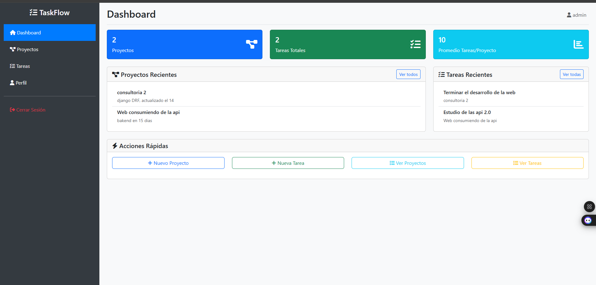
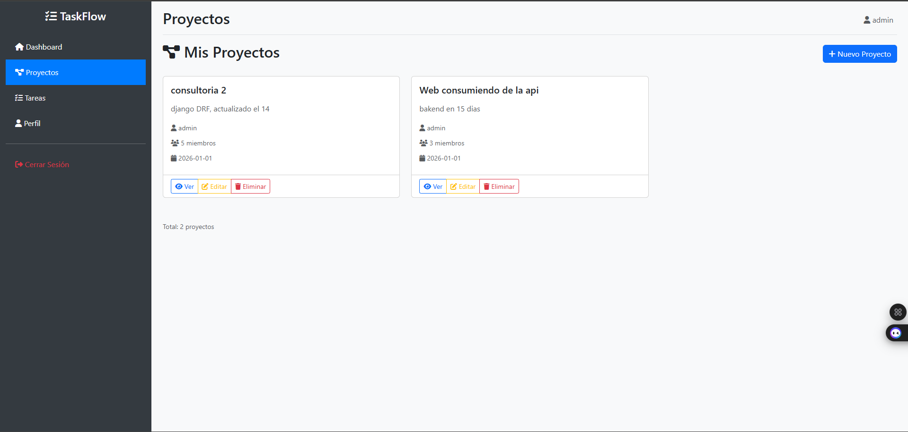
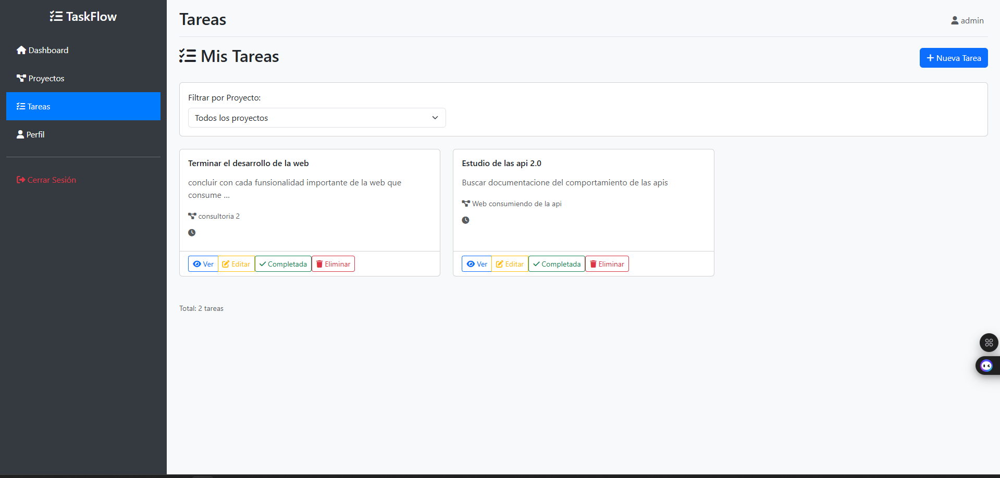
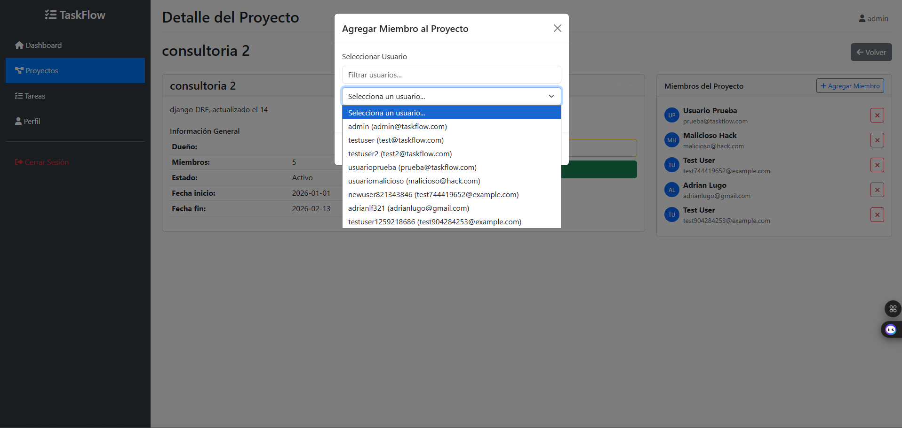
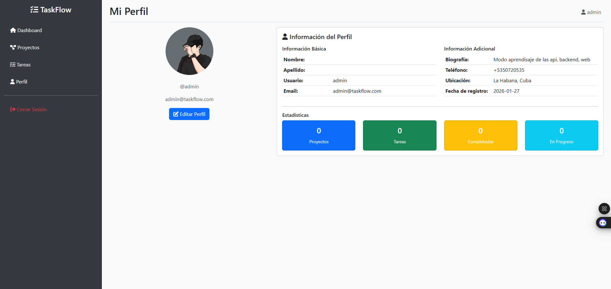

# TaskFlow 🚀

Sistema de gestión de proyectos y tareas con arquitectura de microservicios, frontend Django y API REST Django.

## 📋 Tabla de Contenidos

- [Características](#-características)
- [Arquitectura](#-arquitectura)
- [Tecnologías](#-tecnologías)
- [Instalación](#-instalación)
- [Configuración](#-configuración)
- [Uso](#-uso)
- [API Endpoints](#-api-endpoints)
- [Funcionalidades](#-funcionalidades)
- [Capturas de Pantalla](#-capturas-de-pantalla)
- [Contribución](#-contribución)
- [Licencia](#-licencia)

## ✨ Características

### 🔐 Autenticación y Gestión de Usuarios
- **Login/Logout** con tokens JWT
- **Registro de usuarios**
- **Gestión de perfil** (bio, teléfono, ubicación)
- **Refresh automático de tokens**
- **Sesión segura con almacenamiento en Django

### 📊 Gestión de Proyectos
- **CRUD completo** de proyectos
- **Asignación de miembros** por username
- **Filtro de usuarios** en tiempo real
- **Permisos basados en ownership**
- **Dashboard con estadísticas**
### Gestion de Tareas
- **CRUD completo** de tareas
- **Estados de tarea** (por hacer, en progreso, revision, completado)
- **Marcar como completada** con fecha automatica
- **Asignacion de tarea** a usuarios

### 👥 Gestión de Miembros
- **Selector de usuarios** con búsqueda y filtro
- **Agregado/eliminación** de miembros del proyecto
- **Validación de usernames**
- **UI intuitiva con modales**

### 🎨 Interfaz de Usuario
- **Diseño responsive** con Bootstrap 5
- **Navegación intuitiva** con sidebar
- **Modales interactivos** para operaciones
- **Alertas dinámicas** para feedback
- **Iconos Font Awesome**

## 🏗️ Arquitectura

```
taskflow-main/
├── taskflow-api/          # API REST Backend
│   ├── authentication/    # Autenticación JWT
│   ├── projects/          # Gestión de proyectos
│   ├── tasks/            # Gestión de tareas
│   └── users/            # Gestión de usuarios
├── taskflow_web/         # Frontend Django
│   ├── authentication/   # Vistas de autenticación
│   ├── dashboard/        # Dashboard principal
│   ├── projects/         # Vistas de proyectos
│   ├── core/            # API Service y utilidades
│   └── templates/       # Templates HTML
└── shared/              # Recursos compartidos
```

## 🛠️ Tecnologías

### Backend (API)
- **Django 5.1.4** - Framework web
- **Django REST Framework 3.15.2** - API REST
- **Simple JWT 5.3.1** - Autenticación JWT
- **CORS Headers 4.9.0** - Comunicación cross-origin
- **DRF Spectacular 0.29.0** - Documentación OpenAPI

### Frontend (Web)
- **Django 5.2** - Framework web
- **Bootstrap 5** - Framework CSS
- **Font Awesome** - Iconos
- **JavaScript Vanilla** - Interactividad

### Desarrollo
- **Python 3.8+**
- **Requests 2.32.5** - Cliente HTTP
- **Decouple 3.8** - Configuración de variables

## 🚀 Instalación

### Prerrequisitos
- Python 3.8+
- pip
- Virtual environment (recomendado)

### 1. Clonar el repositorio
```bash
git clone <repository-url>
cd taskflow-main
```

### 2. Crear entorno virtual
```bash
python -m venv .venv
source .venv/bin/activate  # Linux/Mac
# o
.venv\Scripts\activate     # Windows
```

### 3. Instalar dependencias de la API
```bash
cd taskflow-api
pip install -r requirements.txt
```

### 4. Instalar dependencias del Web
```bash
cd ../taskflow_web
pip install -r requirements.txt
```

### 5. Configurar variables de entorno
```bash
# En taskflow-api/.env
DEBUG=True
SECRET_KEY=tu-secret-key-aqui
ALLOWED_HOSTS=localhost,127.0.0.1

# En taskflow_web/.env
DEBUG=True
SECRET_KEY=tu-secret-key-web-aqui
API_BASE_URL=http://localhost:8000/api
ALLOWED_HOSTS=localhost,127.0.0.1
```

### 6. Migraciones y base de datos
```bash
# API
cd taskflow-api
python manage.py makemigrations
python manage.py migrate
python manage.py createsuperuser

# Web
cd ../taskflow_web
python manage.py makemigrations
python manage.py migrate
```

## ⚙️ Configuración

### 1. Iniciar la API
```bash
cd taskflow-api
python manage.py runserver 8000
```

### 2. Iniciar el Frontend Web
```bash
cd taskflow_web
python manage.py runserver 9000
```

### 3. Acceder a la aplicación
- **Frontend**: http://localhost:9000
- **API**: http://localhost:8000/api
- **Documentación API**: http://localhost:8000/api/docs/

## 📖 Uso

### 1. Registro y Login
1. Visita http://localhost:9000/auth/register/
2. Crea una cuenta nueva
3. Inicia sesión en http://localhost:9000/auth/login/

### 2. Gestión de Proyectos
1. Desde el dashboard, click en "Proyectos"
2. Crea un nuevo proyecto
3. Agrega miembros usando el selector de usuarios

### 3. Navegación
- **Dashboard**: Vista general de proyectos y tareas
- **Proyectos**: Lista y gestión de proyectos
- **Perfil**: Gestión de información personal
- **Tareas**: Gestion completa de tareas

## 🔌 API Endpoints

### Autenticacion
```
POST /api/auth/register/     # Registro de usuario
POST /api/auth/login/        # Login de usuario
POST /api/auth/refresh/      # Refresh token
GET  /api/auth/profile/      # Perfil de usuario
PATCH /api/auth/profile/     # Actualizar perfil
```

### Proyectos
```
GET    /api/projects/                # Listar proyectos
POST   /api/projects/                # Crear proyecto
GET    /api/projects/{id}/           # Ver proyecto
PATCH  /api/projects/{id}/           # Actualizar proyecto
DELETE /api/projects/{id}/           # Eliminar proyecto
POST   /api/projects/{id}/members/   # Agregar miembro
DELETE /api/projects/{id}/members/{user_id}/  # Eliminar miembro
```

### Usuarios
```
GET /api/users/                 # Listar usuarios
GET /api/users/{id}/            # Ver usuario
```

### Tareas
```
GET    /api/tasks/              # Listar tareas
POST   /api/tasks/              # Crear tarea
GET    /api/tasks/{id}/         # Ver tarea
PATCH  /api/tasks/{id}/         # Actualizar tarea
DELETE /api/tasks/{id}/         # Eliminar tarea
POST   /api/tasks/{id}/assign/  # Asignar tarea
GET    /api/tasks/{id}/comments/        # Listar comentarios
POST   /api/tasks/{id}/comments/       # Crear comentario
```

## 🎯 Funcionalidades Detalladas

### 🔐 Sistema de Autenticación
- **Tokens JWT**: Access token (15 min) + Refresh token (7 días)
- **Refresh automático**: Renovación transparente de tokens
- **Sesión persistente**: Almacenamiento seguro en Django
- **Logout completo**: Limpieza de todos los tokens

### 📊 Dashboard Principal
- **Estadísticas en tiempo real**: Proyectos y tareas activas
- **Accesos rápidos**: Creación de proyectos y tareas
- **Información de usuario**: Nombre y avatar
- **Navegación intuitiva**: Sidebar con menú contextual

### 🏗️ Gestión de Proyectos
- **CRUD completo**: Crear, leer, actualizar, eliminar
- **Formularios validados**: Validación frontend y backend
- **Permisos de ownership**: Solo el owner puede editar/eliminar
- **Asignación de miembros**: Sistema de selección con filtro

### 👥 Sistema de Miembros
- **Selector inteligente**: Lista desplegable con búsqueda
- **Filtro en tiempo real**: Búsqueda mientras escribes
- **Validación de usernames**: Verificación automática
- **Feedback visual**: Alertas de éxito/error

### 🎨 Experiencia de Usuario
- **Diseño responsive**: Adaptable a móviles y tablets
- **Modales interactivos**: Operaciones sin recargar página
- **Alertas dinámicas**: Feedback inmediato de acciones
- **Iconos intuitivos**: Font Awesome para mejor UX

## 📸 Capturas de Pantalla

### Dashboard Principal


### Gestión de Proyectos


### Gestión de Tareas


### Agregar Miembros


### Perfil de Usuario


## 🤝 Contribución

1. Fork el proyecto
2. Crear una feature branch (`git checkout -b feature/AmazingFeature`)
3. Commit los cambios (`git commit -m 'Add some AmazingFeature'`)
4. Push al branch (`git push origin feature/AmazingFeature`)
5. Abrir un Pull Request

## 📝 Notas de Desarrollo

### Arquitectura de Comunicación
- **Frontend → API**: Consumo de API REST con requests
- **Autenticación**: Tokens JWT en headers Authorization
- **Manejo de errores**: Mapeo de errores API a formularios Django
- **Cache de sesión**: Almacenamiento temporal de datos de usuario

### Buenas Prácticas
- **Separación de responsabilidades**: API y Frontend independientes
- **Manejo de tokens**: Refresh automático transparente
- **Validación completa**: Frontend + backend
- **UX optimizada**: Feedback inmediato y navegación fluida

## 🐛 Problemas Conocidos

- **Notificaciones en tiempo real**: Planeado para futuras versiones
- **Archivos adjuntos**: Funcionalidad pendiente

## 🚀 Próximamente

- [ ] Sistema de notificaciones
- [ ] Archivos adjuntos en proyectos
- [ ] Chat entre miembros
- [ ] Dashboard avanzado con gráficos
- [ ] API GraphQL
- [ ] Aplicación móvil React Native

## 📄 Licencia

Este proyecto está bajo la Licencia MIT - mira el archivo [LICENSE](LICENSE) para detalles.

## 👥 Autores

- **Adrian Lugo Frontela** - *Desarrollador Principal* - [adrianlugo]

## 🙏 Agradecimientos

- Django REST Framework por la excelente API
- Bootstrap por el increíble framework CSS
- Font Awesome por los iconos increíbles
- Comunidad Django por la documentación y soporte

---

**TaskFlow** - Simplifica la gestión de proyectos y tareas. 🚀
